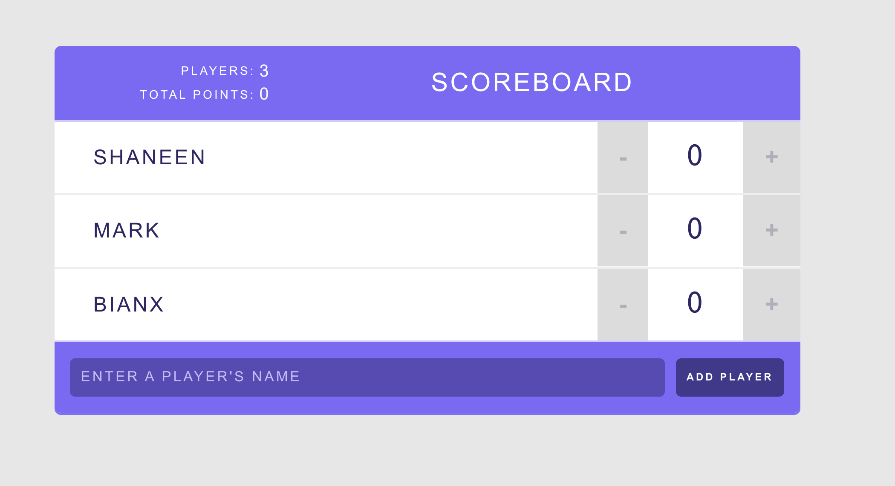

# Score Trackr

> A fun, simple and useful React project using functional components and hooks.

## Table of contents

- [General info](#general-info)
- [Screenshots](#screenshots)
- [Tech Stack](#tech-stack)
- [Setup](#setup)
- [Status](#status)
- [Contact](#contact)

## General info

Score Trackr is a fun and simple project to practice my React skills and best practices when building web applications.

## Screenshots

## Tech Stack

**Languages:** HTML, CSS, Javascript
**Frameworks/Libraries:** React
**Front-end Hosting:** Vercel

## Setup

1. Clone locally or download a zip file
2. `cd score-trackr`
3. `yarn start`
4. Open [http://localhost:3000](http://localhost:3000) to view it in the browser.

You can see the site [here](https://score-trackr.vercel.app/).

## Status

Project is: _in progress_

To-do list:

- [ ] Add a stopwatch
- [ ] Make it responsive

## Contact

Created by [@shaneenvitug](https://www.shaneenvitug.com/) - feel free to contact me!
